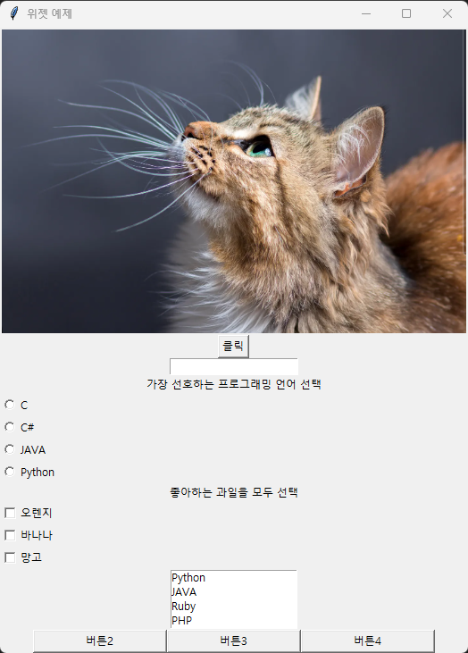

# iot-python-2025
IoT 개발자 기초프로그래밍 언어 리포지토리

## 1일차
- 개발환경 설정
    - 압축, 폰트, 개발용 에디터 설치
        - 반디집(교육용,회사에서 전부 무료)
        - 나눔 글꼴 (2DCoding) 추후 나눔고딕코딩 필요 https://hangeul.naver.com/font
        - NotePad++ https://notepad-plus-plus.org/downloads/
    - Visual studio coed 설치
        - 확장 Korean
        - Font Family D2Coding 추가, Mouse Wheel Zoom 체크 설정정

- 프로그래밍 언어 종류
    - 컴파일러(exe파일 생성)
        - C, C++, C#, java, ...
    - 인터프리터(소스코드를 바로 실행, 실행파일 없음)
        - Python, javascript, ...
    
- 파이썬(Python)
    - 1990대경에 개발한 인터프리터 언어
    - 네덜란드 개발자 귀도 반 로썸
    - 객체지향 프로그래밍 언어(Object Oriented Program)
    - 쉽게 학습할 수 있는 언어

- 파이썬 개발환경 Pyenv
    - 파이썬 버전을 손쉽게 변경할 수 있는 툴
    - 설치 전, 파워셀 관리자모드 오픈, 아래의 명령어 실행
        ```Shell
        > Set-ExecutionPolicy -ExecutionPolicy RemoteSigned -Scope LocalMachine
        ```
    - https://pyenv-win.github.io/pyenv-win/ Quick Start 1번 실행
    - pyenv로 파이썬 버전 설치 및 전역설정

- Visual studio Code
    - 확장에서 Python 설치
    - *.py 파일 생성 후 코딩
    - Ctrl + F5 로 실행

## 2일차
- 파이썬 기초
    - 변수
        - `데이터`를 담아서서 딴데서 쓰기위해 사용
    - 자료형
        - None, int, float, str, bool, list, tuple, dict, set, ...
        - type() 함수로 <class 'str'> 확인가능
    - 화면입출력 - 콘솔에서 입력하고 결과 출력
        - input(), print()
    - 문자열 포맷팅
        - 문자열을 좀 더 깔끔하게 표현
        - %s, %d, %f, .....
        - {0}, {1}, {2}.format() ...
        - f'{name}...{age}"
    - 연산자
        - 사칙연산 : +, -, *, /, //, %, **, (, )
        - 리스트연산 : list[0], list[0:3 + 1]
        - 문자열연산 : split(), replace(), strip, find, ...


- 깃허브[데스크톱]
    1. **fetch origin** : 리모트 최신변경사항 확인(중요!)
    2. pull : 리모트에 변경사항을 내 로컬로 다운로드
    3. Commit : 로컬, 리모트에 변경사항을 확정
    4. push : 로컬에 변경사항을 리모트로 올리기
   
    
## 3일차
- 파이썬 기초
    - 흐름제어
        - if - 참을기준으로 분기
        - for - 일반적인 반복문
        - while - 참인 조건일 동안 무한반복
    - 파일입출력
        - open(경로, mode='r|w|a', encoding='utf-8')
        - write(), readline()
        - close()
    - 함수
        - f(x) = y
        - 자주 사용할 로직을 묶어놓은 덩어리
        - 함수 호출
        ```python
        def funcName(param):
            # 로직
        ```
    - 객체지향
        - 현실세계와 동일하게 프로그래밍 하겠다는 설계방식
        - 객체의 틀이되는 클래스 선언
        - 클래스 : 명사와 동사의 집합
            - 명사 : 멤버변수(속성)
            - 동사 : 멤버함수(메서드)

        ```python
        class ClassName:
            # 멤버변수
            
            def 멤버함수(self, param):
                # 로직
        ```

## 4일차
- 파이썬 기초
    - 리스트 연산 추가
        - append(), insert(index, value), del(lest[index]), pop(), sort(), ...
    - 객체지향 복습
        - 모든 클래스의 조상은 object 클래스!
        - 클래스 작성방법
        - 속성(멤버변수)
        - 메서드(멤버함수)
        - 캡슐화 - 멤버변수 폐쇄화, __멤버변수
        - 상속 - 상위클래스를 가지고 자식클래스 만드는 것것
        - **추상화**
        - **인터페이스**
        - **다형성**
        - **SOLID 원칙**

    - 모듈, 패키지
        - 함수나 클래스 등 자주 사용할 파이썬 파일로 만든것
        - 패키지(라이브러리) : 모듈(py01,02,03.....)을 모아둔 폴더
        - pip : 외부모듈 다운로드 설치하는 명령

    - 예외처리
        - 예외 : 실행 중 프로그램 비정상 종료되는 Error


## 5일차
- 파이썬 기초
    - 예외처리
        - 프로그래밍에서 가장 중요!
        - 실행 중 발생하, 프로그램을 비정상 종료시키는 것
    - 디버깅
        - F9, F5, F10, F11, Shift+F5, 변수탭, 조사식탭
        - 버그를 잡을 때 가장 유용
        - 소스코드를 분석할 때

- 파이썬 응용
    - 토이프로젝트
        - 콘솔앱 : My Movie List

## 6일차
- 파이썬 응용
    - 토이프로젝트
        - 내 영화 앱 수정, 마무리
            - 예외처리 : 입력시 바로 엔터, 입력시 4개의 아이템을 입력하지 않으면,
            - 화면편집 : 검색이나 출력시 데이터 수 표시


 https://github.com/user-attachments/assets/f9d042ae-80c1-49c6-8d56-5dda527aa309
- 파이썬 응용
    - 주피터노트북 기본사용법
        - 파이썬을 사용, 연구를 목적으로하는 리포트 작성에 특화된 기술
        - 주피터 프로젝트에서 나온 결과물 ipynb
        - Ctrl + Shift + P (명령 팔레트) 에서 시작
            - Create: 새 Jupyter 노트북 클릭
            - 시작할 때 무조건 저장 먼저!(.ipynb)

    - GUI 학습
        - GUI(Graphic User Interface) - 그래픽 사용자 인터페이스
        - CLI(Console Line Interface) - GUI 이전 사용자 인터페이스, 사용이 불편. 사용자가 명령어를 거의 다 외워서 사용
        - GUI 학습에는 불합리
        - 빅데이터분석, 머신러닝, 딥러닝 많이 활용

    - 파이썬 GUI 라이브러리
        1. PyQt, PySide : 파이썬 최고의 GUI 라이브러리. Qt라는 C/C++ 사용할 GUI 라이브러리를 Python용으로 변경
                - 화려한 UI구성
                - 코딩 다양성
                - 조금 어렵다(파이썬 코드와 분리가능)
                - Qt가 라이선스를 구매필수, 프리웨어로 변경한게 PySide
        2. tkinter : 파이썬에 내장된 GUI 라이브러리.
                - 아주 단순. 학습이 쉬움
                - 파이썬 기본 내장
                - 안 이쁘다
        3. Kivy : 가장 최근에 나온 GUI 라이브러리
                - 안드로이드, iOS 모바일 앱 UI 사용가능
                - 모바일 특화로 멀티플랫폼 지원
                - 가장 어렵다


    - Tkinter 학습
            - 기본 템플릿

            ``` Python
            from tkinter import *

            root = Tk()

            # 이 사이에 위젯, 이벤트 등 작성
            # Label, Button, Entry, Radibutton
            # Checkbutton, Listbox, Frame 등... -> 부모Class 가 위젯임
                
            # 위젯 pack() 필수,,!!
            root.mainloop()
            ```
        <!--주석 -->
        <!-- html에서 사용하는  태그로 캡처한 이미지를 추가 -->
        <!--  -->
        

## 7일차
- 파이썬 응용
    - 토이프로젝트
        - ChatGPT 유사앱 - 구글 제미나이 API
    - 실습
        - 제미나이 챗앱 -> **클래스형태**로 변경

https://github.com/user-attachments/assets/942d9492-e4bc-41cf-a999-347011fd4ddb

- 파이썬 응용
    - 실행파일 만들기
        - `pyinstaller` 모듈 설치
            pip install pyinstaller
        - 실행파일 명령어(터미널에 실행)
            pyinstaller --onefile 파이썬파일명
            - 같이 실행되는 터미널 제거하려면
            pyinstaller --onefile --noconsole 파이썬파일명
            - 아이콘등의 리소스를 dist 폴더에 복사해야

## 8일차
- 파이썬 응용
    - GUI중 PyGame
        - 기본 윈도우 학습
        - 이벤트 처리
        - 간단한 게임
        - 이미지, 사운드 등 리소스 활용 게임

    - 토이프로젝트
        - 블록깨기 게임
        - 공의 위치에 대한 수식
            - 공의 x축 방향 계산방법 : $x = r \cdot \cos \theta$
            - 공의 y축 방향 계산방법 : $y = r \cdot \sin \theta$
        - 공의 시작방향, 경계부분 문제 해결, 종료 후 다시 시작 로직

<!--$$ y = r \cdot \sin \theta $$--> 

  

## 9일차
- 코딩 테스트
